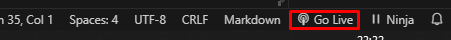
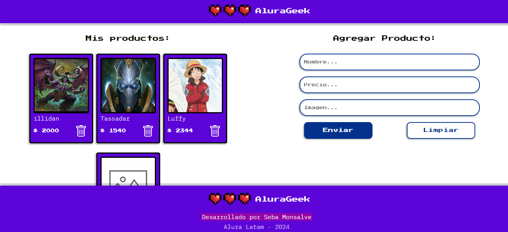

# Alura Geek

AluraGeek es un proyecto simple para profundizar en el desarrollo web usando HTML5, CSS3 y Javascript donde se busca interactuar con una API y sus endpoint. 

### Pre-requisitos 📋

```
Navegador web compatible
NodeJs
Visual Studio Code
Extension VS :: LiveServer
Extension VS :: json-server
```

### Instalación 🔧

1. Clonar el proyecto

```
git clone https://github.com/Seba-Monsalve/alura-alurageek.git
```

2.  Instalar json-server

  ```
  npm i json-server
  ```

3. Desde un terminal, ejecutar json-server con el parametro -watch

```
npx -watch json-server data/db.json
```

4. Go Live con LiveServer para ver el proyecto
   


## Visualizacion



## Notas

Se dispone de un json de prueba llamado 'db.json.template' con el cual puedes hacer pruebas

## Autores ✒️

_Menciona a todos aquellos que ayudaron a levantar el proyecto desde sus inicios_

* **Seba Monsalve [villanuevand](https://github.com/seba-monsalve)
  
## Expresiones de Gratitud 🎁

* Gracias a Alura por estas oportunidades de practica 
* Plantilla Readme por [Villanuevand](https://github.com/Villanuevand) 😊

